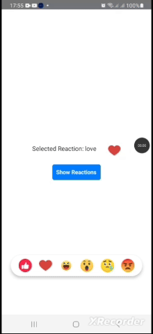

# react-native-animated-reactions

This is the fully customizable React Native component for displaying a reaction bar with animated reaction icons. It's designed to provide a visually appealing and interactive way to let users select from a list of predefined reactions, such as "like," "love," "haha," "wow," "sad," and "angry." The component leverages Reanimated for smooth animations and provides methods for showing and dismissing the reaction bar programmatically. It is ideal for integrating into social media apps, chat applications, or any app where user feedback is required.

## Installation

```sh
npm install @herberthtk/react-native-animated-reactions
```
## Test on your phone
> You can test [on this expo snack](https://snack.expo.dev/@herberthk/react-native-animated-reactions)
## Demo


### Dependencies
- React Native Reanimated: For handling animations.
- React Native: For creating the core UI components.

### Features
- Smooth Animations: Powered by react-native-reanimated for spring and timing-based animations.
- Bounce Feedback: Adds a bounce effect to the selected reaction for improved interactivity.
- Programmatic Control: Exposes methods to show or dismiss the reaction bar via a ref.
- Callback Support: Triggers events when a reaction is selected or the reaction bar is dismissed.

## Usage


```js
import { useRef, useState } from 'react';
import {
  Image,
  Pressable,
  StyleSheet,
  Text,
  TouchableOpacity,
  View,
} from 'react-native';
import ReactionBar, {
  type ReactionBarRef,
  type Reaction,
} from '@herberthtk/react-native-animated-reactions';

const App = () => {
  const reactionBarRef = useRef<ReactionBarRef>(null);
  const [selectedReaction, setSelectedReaction] = useState<Reaction | null>(
    null
  );
  const handleReactionSelect = (reaction: Reaction) => {
    console.log('Selected Reaction:', reaction);
    setSelectedReaction(reaction);
  };

  const onDismiss = () => {
    console.log('Reaction bar dismissed');
  };

  const showReaction = () => {
    reactionBarRef.current?.showReactions();
  };

  const dismissReaction = () => {
    reactionBarRef.current?.dismissReactions();
  };

  return (
    <Pressable style={styles.container} onPress={dismissReaction}>
      {selectedReaction && (
        <View style={styles.selectedItem}>
          <Text style={styles.selectedReactionText}>
            Selected Reaction: {selectedReaction.id}
          </Text>
          <Image
            source={{ uri: selectedReaction.iconUrl }}
            style={styles.selectedIcon}
          />
        </View>
      )}

      <TouchableOpacity onPress={showReaction} style={styles.triggerButton}>
        <Text style={styles.triggerButtonText}>Show Reactions</Text>
      </TouchableOpacity>

      {/* Overlay and positioning are handled here */}

      <ReactionBar
        ref={reactionBarRef}
        onReactionSelect={handleReactionSelect}
        onDismiss={onDismiss}
      />
    </Pressable>
  );
};

const styles = StyleSheet.create({
  container: {
    flex: 1,
    justifyContent: 'center',
    alignItems: 'center',
  },
  triggerButton: {
    padding: 10,
    backgroundColor: '#007BFF',
    borderRadius: 5,
  },
  triggerButtonText: {
    color: '#FFFFFF',
    fontWeight: 'bold',
  },
  selectedReactionText: {
    fontSize: 16,
    color: '#333',
  },
  selectedItem: {
    marginBottom: 20,
    flexDirection: 'row',
    gap: 30,
  },
  selectedIcon: {
    width: 32,
    height: 32,
  },
});

export default App;

```

### Reaction Object
The `Reaction` object has the following structure:
```ts
type Reaction = {
  id: string;        // Unique identifier for the reaction
  iconUrl: string;   // URL of the reaction icon
};

```

### Props

| Prop               | Type                             | Description                                               |
|--------------------|----------------------------------|-----------------------------------------------------------|
| `onDismiss`        | `() => void`                    | Callback triggered when the reaction bar is dismissed.    |
| `onReactionSelect` | `(reaction: Reaction) => void`  | Callback triggered when a reaction is selected.           |

### Methods

The `ReactionBar` exposes the following methods via `ref`:

| Method             | Description                                               |
|--------------------|-----------------------------------------------------------|
| `showReactions`    | Displays the reaction bar with a spring animation.         |
| `dismissReactions` | Hides the reaction bar with a timing animation.            |


### Contributing

See the [contributing guide](CONTRIBUTING.md) to learn how to contribute to the repository and the development workflow.

#### Support
If you find this package useful, please give it a star ⭐ on github to support my efforts, I work on this project in my free time

### License

MIT

---

Made with :heart: by [Herbert kavuma](https://herbert.netbritz.com/)
